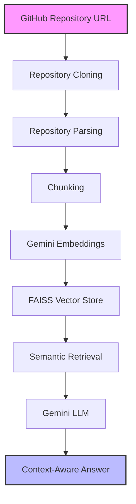

# AI Repository Assistant

AI Repository Assistant is a full-stack RAG-based application that allows users to analyze and interact with GitHub repositories using natural language.

Users can provide a GitHub repository URL, after which the system:

- clones and parses the repository
- generates semantic embeddings
- stores repository context in a FAISS vector database
- retrieves relevant code/documentation chunks
- answers repository-related questions using Gemini LLM

The project is designed to demonstrate:

- Retrieval-Augmented Generation (RAG)
- semantic code search
- vector databases
- LLM integration
- backend engineering
- scalable AI application architecture

---

# Features

- GitHub repository ingestion
- Repository parsing and filtering
- Recursive chunking
- Semantic search using embeddings
- FAISS vector storage
- Retrieval-Augmented Generation (RAG)
- Gemini-powered contextual answers
- Source file references in responses
- FastAPI backend
- React + Tailwind frontend
- Docker support

---

# Tech Stack

## Frontend

- React
- Vite
- TailwindCSS

## Backend

- Python
- FastAPI

## AI / RAG

- LangChain
- Google Gemini API
- FAISS Vector Database

## Other Tools

- GitPython
- Docker
- dotenv

---

# Project Structure

```bash
AI-Repository-Assistant/
│
├── backend/
│   ├── app/
│   │   ├── api/
│   │   ├── core/
│   │   ├── models/
│   │   ├── services/
│   │   └── utils/
│   │
│   ├── main.py
│   ├── requirements.txt
│   └── .env.example
│
├── frontend/
│   ├── src/
│   │   ├── components/
│   │   ├── hooks/
│   │   ├── pages/
│   │   ├── api.js
│   │   ├── App.jsx
│   │   └── main.jsx
│   │
│   ├── index.html
│   ├── vite.config.js
│   └── tailwind.config.js
│
└── README.md
```

## Architecture



---

# Supported File Types

The system currently processes:

- `.py`
- `.js`
- `.ts`
- `.tsx`
- `.java`
- `.md`
- `.json`
- `.yml`
- `.yaml`
- `.txt`

Ignored directories/files:
- `node_modules`
- `.git`
- `dist`
- `build`
- binary files

---

# API Endpoints

## Health Check

GET /health

---

## Index Repository

POST /api/index-repo

### Request Body

{
  "repo_url": "https://github.com/user/repository"
}

---

## Chat With Repository

POST /api/chat

### Request Body

{
  "question": "Explain authentication flow"
}

---

# Environment Variables

Create a `.env` file inside `backend/`.

GEMINI_API_KEY=your_api_key_here

---

# Local Setup

## 1. Clone Repository

git clone https://github.com/your-username/AI-Repository-Assistant.git

cd AI-Repository-Assistant

---

# Backend Setup

cd backend

python -m venv venv

# Windows
venv\Scripts\activate

# Linux / Mac
source venv/bin/activate

pip install -r requirements.txt

uvicorn main:app --reload

Backend runs on:

http://localhost:8000

---

# Frontend Setup

cd frontend

npm install

npm run dev

Frontend runs on:

http://localhost:5173

---

# Docker Setup

## Run Entire Application

docker-compose up --build

---

# Screenshots

## Home Interface

_Add screenshot here_

---

## Repository Chat Interface

_Add screenshot here_

---

# Example Queries

- Explain project architecture
- Where is JWT authentication implemented?
- Which files use Redis?
- Summarize API routes
- Explain database schema
- Describe microservice communication flow

---

# Future Improvements

- Multi-repository support
- Persistent vector database
- Streaming responses
- Authentication
- Hybrid search
- Repository summarization
- Conversation memory
- Multi-LLM support
- Code dependency visualization

---

# Learning Outcomes

This project demonstrates practical implementation of:
- Retrieval-Augmented Generation (RAG)
- semantic retrieval systems
- vector databases
- LLM-powered workflows
- AI-assisted developer tooling
- scalable backend architecture

---

# License

This project is licensed under the MIT License.